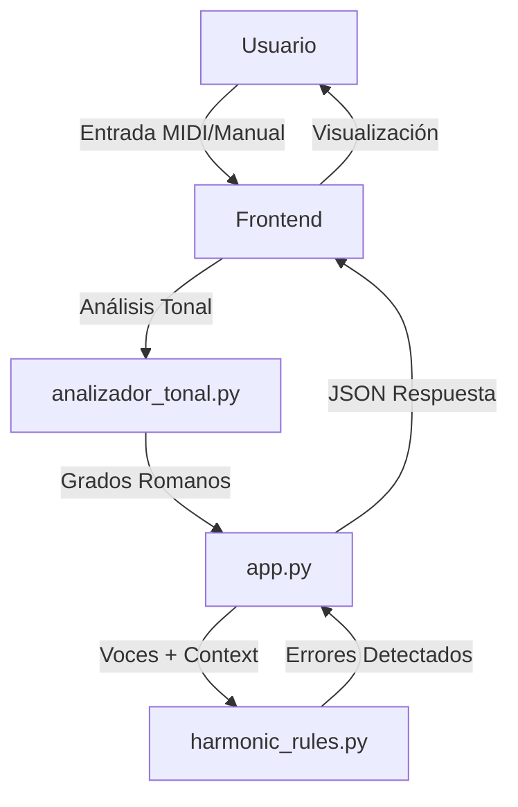

# Armonía Web - Arquitectura del Sistema

> **Versión:** 3.0-alpha (Phase 3A - 80% Complete)  
> **Última actualización:** 2025-12-30  
> **Propósito:** Mapa completo del sistema para prevenir regresiones y duplicación de código  
> **Reglas Activas:** 12/15 (7 Tier 1 + 5 Tier 2)

---

## 📐 Visión de Alto Nivel

**Armonía Web** es una aplicación educativa para enseñanza de armonía tonal (SATB - escritura a 4 voces). El sistema analiza partituras insertadas por el usuario y detecta errores armónicos según las reglas de la pedagogía clásica.



---

## 🗂️ Estructura de Archivos Críticos

### **Backend (Python + Flask)**

| Archivo | Responsabilidad | Líneas | Última Modificación |
|---------|----------------|--------|-------------------|
| `app.py` | API REST, orquestación | ~300 | 2025-12-27 |
| `analizador_tonal.py` | Análisis de grados romanos | ~500 | 2025-12-20 |
| **`harmonic_rules.py`** | **Motor de reglas armónicas** | **~2380** | **2025-12-29** |
| **`chord_knowledge.py`** | **Sistema análisis de factores** | **785** | **2025-12-28** |
| `integration_bridge.py` | Puente opciones/reglas | ~200 | 2025-12-21 |

### **Frontend (HTML + JavaScript + VexFlow)**

| Archivo | Responsabilidad |
|---------|----------------|
| `static/js/app.js` | Lógica principal de UI |
| `static/js/renderer.js` | Renderizado de partituras (VexFlow) |
| `static/index.html` | Estructura de la aplicación |

---

## 🔄 Flujo de Datos Completo

### 1. **Entrada del Usuario**

```
Usuario → Frontend:
- Inserta notas manualmente O carga MIDI
- Selecciona tonalidad (Do Mayor, La menor, etc.)
- Hace clic en "Revisar"
```

### 2. **Análisis Tonal** (`analizador_tonal.py`)

```python
# Entrada: Lista de acordes SATB + Tonalidad
# Salida: Grados romanos + Función armónica (T, S, D)

CerebroTonal.analizar_progresion(acordes, tonalidad)
# → Retorna: [{'grado': 'I', 'funcion': 'T', 'inversion': 0}, ...]
```

### 3. **Motor de Reglas** (`harmonic_rules.py`)

```python
# Entrada: chord1, chord2, context={'key': 'C major'}
# Salida: Lista de errores detectados

RulesEngine.validate_progression(chord1, chord2, context)
# → Retorna: [
#    {'rule': 'parallel_fifths', 'voices': ['S', 'A'], ...},
#    {'rule': 'leading_tone_resolution', ...}
# ]
```

**CRÍTICO:** El `context['key']` es inyectado automáticamente en `chord1/chord2` por el método `HarmonicRule.validate()` (líneas 276-283). Sin este fix, las reglas que dependen de tonalidad fallan en producción.

### 4. **Respuesta al Frontend**

```python
# app.py formatea errores:
engine.format_errors_for_app(errors, compas, tiempo_index)
# → {'mensaje': 'Compás 1, T2: Quintas paralelas (Bajo-Tenor)', ...}
```

---

## 🧩 Componentes Clave de `harmonic_rules.py`

### **Arquitectura del Motor**

```
harmonic_rules.py
├── Enumeraciones
│   ├── ConfidenceLevel (CERTAIN=100, HIGH=80, ...)
│   └── RuleTier (CRITICAL=1, IMPORTANT=2, ADVANCED=3)
│
├── Infraestructura
│   ├── ContextAnalyzer (líneas 56-177)
│   │   └── Detecta excepciones contextuales (V-VII, cambios de disposición)
│   ├── HarmonicRule (líneas 184-352) [CLASE BASE]
│   │   ├── validate() → Orquesta detección + excepciones
│   │   ├── _detect_violation() → [ABSTRACTO] Implementado por cada regla
│   │   └── _calculate_confidence() → Nivel de confianza (0-100%)
│   └── VoiceLeadingUtils (líneas 359-619)
│       ├── get_interval_object() → Intervalos music21
│       ├── is_perfect_fifth(), is_octave(), etc.
│       ├── get_motion_type() → parallel/contrary/oblique
│       ├── get_scale_degree_info() → Grado escala + sensible
│       ├── get_degree_from_chord() → Grado romano (I, V, vi, ...)
│       └── get_chord_factor() → Identifica 1, 3, 5, 7
│
## Voice Leading Analysis

**Module:** `harmonic_rules.py` (Class: `VoiceLeadingUtils`)

Static utility methods for analyzing intervals and voice movement:
- `get_interval_object(note1, note2)` - Calculate music21 interval
- `get_interval_semitones(note1, note2)` - Direct semitone calculation
- `is_parallel_motion(...)` - Detect parallel movement
- `is_contrary_motion(...)` - Detect contrary movement
- `get_scale_degree_info(note, key)` - Analyze scale degree properties
- `get_degree_from_chord(chord, key)` - Determine chord degree (I, ii, V, etc.)
- `get_chord_factor(note, root)` - **[NEW]** Determine harmonic factor (1, 3, 5, 7) using pitch class arithmetic

---

## Chord Knowledge System  ⭐ NEW (2025-12-28)

**Module:** `chord_knowledge.py`

Sistema centralizado de conocimiento sobre acordes del sistema tonal con análisis automático de factores y progresiones.

### **Componentes Principales:**

#### **1. ChordDefinitions (Static Knowledge)**
Diccionario estático con 14 tipos de acordes documentados:

**Diatónicos (8):**
- Triadas: `major`, `minor`, `diminished`
- Cuatriadas: `dominant_seventh`, `diminished_seventh`, `half_diminished`, `major_seventh`, `minor_seventh`

**Cromáticos (6):**
- Secundarios: `secondary_dominant`, `secondary_leading_tone_dim`, `secondary_leading_tone_half_dim`
- Alterados: `neapolitan_sixth`
- Sextas aumentadas: `italian_augmented_sixth`, `french_augmented_sixth`, `german_augmented_sixth`

Cada definición contiene:
- `morphology`: Intervalos desde la fundamental
- `figured_bass`: Cifrado barroco por inversión
- `factors_in_inversion`: Qué factor está en el bajo
- `syntax`: Resolución típica
- `special`: Información adicional (sensible, tritono, etc.)
- `category`: Clasificación (`diatonic_triad`, `chromatic_secondary`, etc.)
- `detection`: **[Tipos cromáticos]** `method='external'` indica detección en `analizador_tonal.py`

#### **2. Chord Class (Dynamic Analysis)**
Representa un acorde SATB con análisis automático:

```python
chord = Chord(
    voices={'S': 'G4', 'A': 'E4', 'T': 'C4', 'B': 'C3'},
    root='C',
    quality='major',
    key='C major',
    inversion=0
)
```

**Análisis automático en `__post_init__`:**

- Determina `voice_factors`: qué factor (1, 3, 5, 7) tiene cada voz
- Calcula `chord_type` desde `quality`
- Detecta `has_seventh`

**Métodos de consulta vertical:**

- `get_factor_for_voice(voice)` → '1', '3', '5', '7', '?'
- `get_voices_with_factor(factor)` → `['S', 'B']`
- `has_factor(factor)` → `True/False`
- `is_complete()` → Verifica 1-3-5 presentes
- `get_doubled_factors()` → `['1']` si fundamental duplicada
- `get_missing_factors()` → `['5']` si falta quinta
- `get_definition()` → Dict completo de ChordDefinitions
- `get_figured_bass()` → '6/4', '7/+', etc.

#### **3. Progression Class (Horizontal Analysis)**

Analiza movimiento de factores entre acordes:

```python
progression = Progression(chord1, chord2)
movements = progression.get_all_factor_movements()
# → {'S': ('7', '3'), 'A': ('5', '1'), ...}
```

**Métodos:**

- `get_factor_movement(voice)` → `('7', '3')`
- `get_voices_with_movement(from, to)` → `['S']`
- `get_all_factor_movements()` → Dict completo

### **Integración con Reglas:**

#### **Helper Function:**

```python
def _dict_to_chord_safe(chord_dict: Dict) -> Optional[Chord]:
    """Convierte Dict SATB → Chord con fallback seguro."""
```

**Reglas refactorizadas para usar Chord:**

1. **SeventhResolutionRule** (líneas 1547-1630):
   - Usa `chord.get_voices_with_factor('7')` en lugar de loop manual
   - Fallback a método legacy si conversión falla

2. **LeadingToneResolutionRule** (líneas 1401-1519):
   - Usa `chord.get_factor_for_voice()` para detectar sensible local (3ª)
   - Mantiene lógica sensible tonal intacta
   - Fallback completo para backward compatibility

### **Separation of Concerns:**

**chord_knowledge.py:**

- Conocimiento teórico (morfología, sintaxis)
- Análisis de acordes desde Dict SATB
- Consultas de factores y progresiones

**analizador_tonal.py:**

- Detección práctica de acordes cromáticos
- Requiere `music21.chord.Chord`
- `DetectorFunciones.detectar_dominante_secundaria()`
- `DetectorAcordesEspeciales.detectar_napolitana()`
- `DetectorAcordesEspeciales.detectar_sexta_aumentada()`

**Futuro:** Si se necesita detectar cromáticos desde `harmonic_rules.py`, crear adapter Dict → music21.chord.Chord.

---
├── Reglas Tier 1 (CRITICAL) - Implementadas
│   ├── Regla #1: ParallelFifthsRule (líneas 626-751)
│   ├── Regla #2: ParallelOctavesRule (líneas 758-846)
│   ├── Regla #3: DirectFifthsRule (líneas 853-998)
│   ├── Regla #4: DirectOctavesRule (líneas 1005-1142)
│   ├── Regla #5: UnequalFifthsRule (líneas 1149-1277)
│   ├── Regla #6: LeadingToneResolutionRule (líneas 1284-1431)
│   └── Regla #7: SeventhResolutionRule (líneas 1437-1503)
│
└── RulesEngine (líneas 1510-1709)
    ├── **init**() → Registra reglas por defecto
    ├── validate_progression() → Ejecuta todas las reglas habilitadas
    └── format_errors_for_app() → Formatea para app.py

```

---

## 🔑 Decisiones Arquitectónicas Importantes

### **1. Inyección de `key` en Context (FIX CRÍTICO 28-12-2025)**

**Problema:** El frontend envía la tonalidad en `context['key']`, NO en `chord1/chord2['key']`.

**Solución:** El método `HarmonicRule.validate()` inyecta automáticamente el key:

```python
# Líneas 276-283 de harmonic_rules.py
if 'key' in context:
    if 'key' not in chord1:
        chord1 = {**chord1, 'key': context['key']}
    if 'key' not in chord2:
        chord2 = {**chord2, 'key': context['key']}
```

**Impacto:** Sin este código, reglas como `LeadingToneResolutionRule` NO funcionan en producción.

### **2. Manejo de Grados Desconocidos ('?')**

**Problema:** Si `chord2` no tiene campo `'root'`, `get_degree_from_chord()` retorna `'?'`.

**Solución:** En `LeadingToneResolutionRule` (líneas 1400-1403), si `chord2_degree == '?'`, se asume "strict interpretation" y NO se permite excepción.

```python
if chord2_degree == '?':
    # No permitir excepción, continuar validando
    pass
```

### **3. Detección de Sensibles Locales (Dominantes Secundarias)**

**Estado:** Implementación parcial.

**Lógica actual** (líneas 1343-1362):

1. Verifica movimiento de raíces: `root1 → root2` debe ser P4 o P5 (descendente)
2. Calcula si `note1` es M3 de `root1` usando pitch classes (`diff % 12 == 4`)
3. Si sí, marca como `is_local_sensible`

**Limitación conocida:** Requiere que `chord1` y `chord2` tengan campo `'root'`. En producción, este campo a veces falta, causando que V/V no se detecte.

---

## 📊 Mapa de Colores de Errores

| Regla | Color | Código | Razón |
|-------|-------|--------|-------|
| Quintas Paralelas | Rojo | #FF0000 | Error grave (CRITICAL) |
| Octavas Paralelas | Rojo | #FF0000 | Error grave (CRITICAL) |
| Quintas Directas | Amarillo | #FFFF00 | Advertencia seria |
| Octavas Directas | Amarillo | #FFFF00 | Advertencia seria |
| Quintas Desiguales | Naranja | #FFA500 | Advertencia seria |
| **Sensible sin resolver** | **Peru** | **#CD853F** | Error (marrón claro) |
| **Séptima sin resolver** | **Rojo** | **#FF0000** | Error grave |

---

## 🚀 Extensibilidad del Sistema

### **Para Añadir una Nueva Regla:**

1. **Crear clase** heredando de `HarmonicRule`:

```python
class MiNuevaRegla(HarmonicRule):
    def __init__(self):
        super().__init__(
            name='mi_regla',
            tier=RuleTier.CRITICAL,
            color='#00FF00',
            short_msg='Error breve',
            full_msg='Explicación pedagógica completa'
        )
    
    def _detect_violation(self, chord1, chord2):
        # Lógica de detección
        if condicion_error:
            return {'chord_index': 0, 'voices': ['S', 'A']}
        return None
    
    def _calculate_confidence(self, chord1, chord2, context):
        return ConfidenceLevel.HIGH.value  # 80%
```

1. **Registrar en `RulesEngine._register_default_rules()`** (línea 1543+):

```python
self.register_rule(MiNuevaRegla())
```

1. **Crear tests** en `tests/test_mi_regla.json`

---

## 🧪 Testing

### **Estructura de Tests**

```
tests/
├── test_parallel_fifths.json
├── test_leading_tone.json
├── test_seventh_resolution.json
├── run_leading_tone_tests.py  (runner)
└── ...
```

### **Formato de Test Case**

```json
{
  "id": "test_001",
  "name": "Descripción",
  "chord1": {"B": "C3", "T": "E3", "A": "G4", "S": "C5", "key": "C major"},
  "chord2": {"B": "G2", "T": "D3", "A": "G4", "S": "B4", "key": "C major"},
  "expected": "ERROR" | "OK",
  "voices_affected": ["S", "A"]  // Si expected = ERROR
}
```

---

## ⚠️ Problemas Conocidos / TODOs

### **1. Campo `root` faltante en producción**

**Status:** Pendiente investigación

**Impacto:** Detectación de dominantes secundarias (V/V, V/IV) no funciona

**Solución propuesta:** Investigar dónde se debe calcular el `root` (¿frontend? ¿analizador_tonal?)

### **2. Excepción de descenso cromático (V/V → V7)**

**Status:** No implementada

**Descripción:** La sensible de V/V (ej: C# en A7) puede bajar cromáticamente a C♮ si resuelve en V7 (G7).

**Implementación futura:** Añadir excepción en `LeadingToneResolutionRule` (líneas 1417+)

### **3. Cifrado de dominantes secundarias**

**Status:** Problema del módulo `analizador_tonal.py`, NO del motor de reglas

**No afecta** la detección de errores.

---

## 📝 Convenciones de Código

- **Docstrings:** Estilo Google (triple comillas con Args, Returns, Examples)
- **Nombres de métodos privados:** Prefijo `_` (ej: `_detect_violation`)
- **Nombres de voces:** `S` (Soprano), `A` (Alto/Contralto), `T` (Tenor), `B` (Bajo)
- **Logging:** `logger.info()` para eventos importantes, `logger.debug()` para detalles, `logger.warning()` para casos edge

---

## 🔗 Referencias Pedagógicas

- **Piston, Walter:** "Armonía" (Armonía de práctica común)
- **Diether de la Motte:** "Armonía" (Pedagogía europea)
- **Dubois, Théodore:** "Traité d'Harmonie Théorique et Pratique"

---

**Fin del documento ARCHITECTURE.md**
